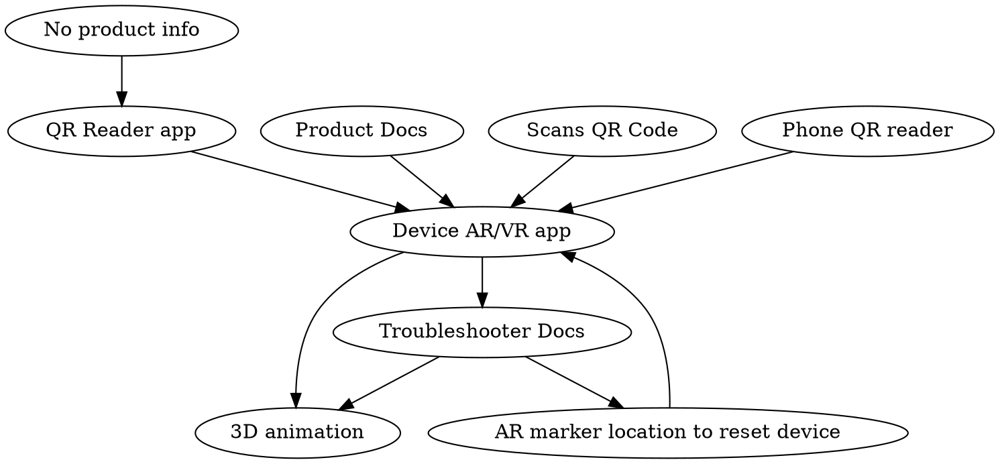

# CXE AR.JS Demos

## Resources

https://aframe.io/blog/arjs/

## Use Cases

### Error Message Use Case

As an individual who is using the oven, I want to resolve the error message on screen, so that I can finish cooking.

- User scans QR code on side of device (which has product info in it).
- Directed to AR app with product info on it.
- Clicks on Troubleshooter. (See info). See animation?

## Examples

https://github.com/fidiego/arjs-demos
https://stemkoski.github.io/AR-Examples/
https://medium.com/chialab-open-source/10-tips-to-enhance-your-ar-js-app-8b44c6faffca
https://skarredghost.com/2019/08/29/how-to-seamless-mobile-ar-js/
https://developer.mozilla.org/en-US/docs/Games/Techniques/3D_on_the_web/Building_up_a_basic_demo_with_A-Frame